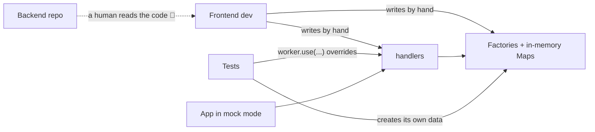
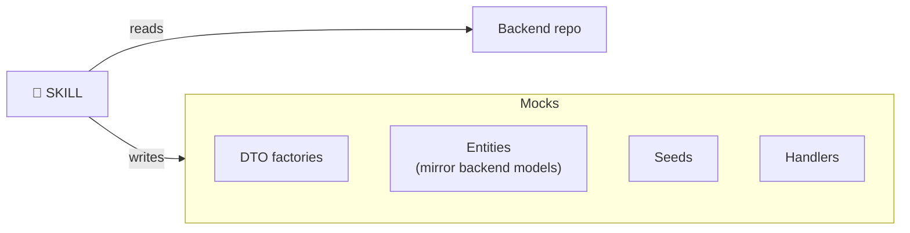
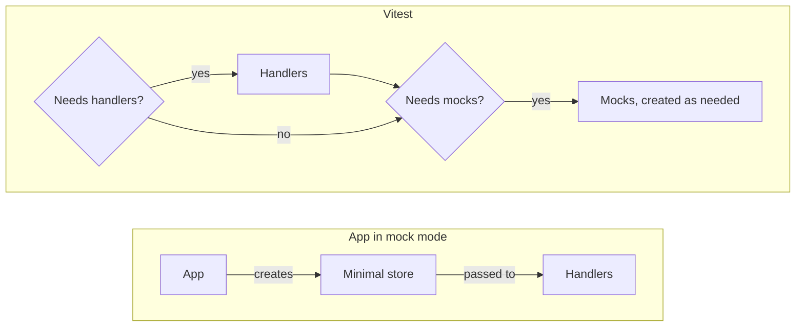
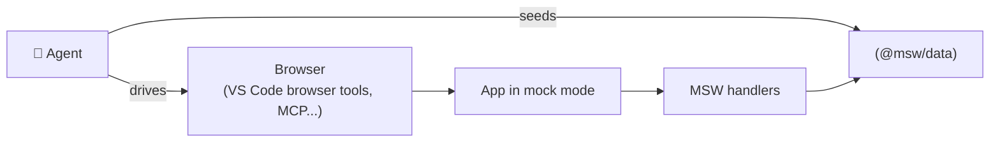
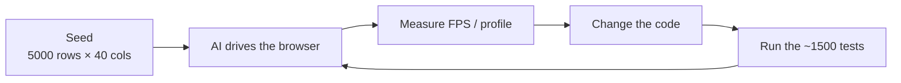

# Simulated backend for frontend

## Testing without simulated users or expensive setups

AI-assisted tests with confidence, without relying on real backend setups.

---

# Disclaimer

There is no silver bullet. This is **one** way, the one that worked for us.

| Approaches we consider     | PROS                                                              | CONS                                                                                                                                                     |
| -------------------------- | ----------------------------------------------------------------- | -------------------------------------------------------------------------------------------------------------------------------------------------------- |
| **Full backend locally**   | Real business rules and responses. Catches integration bugs early | Must run databases, queues, caches and other services. Grows with each new backend dependency until it's tricky, or impossible, to run fully             |
| **Shared dev environment** | Zero local setup. Closest to production                           | Shared, unstable data that changes under your feet. May be down when you need it. Needs real users and tokens, plus a way to roll back what tests create |
| **Testcontainers & co.**   | Real services, reproducible and disposable per run                | Heavy images and slow startup, especially on CI. You still need to know how to run and seed every backend service                                        |
| **Simulated backend**      | Very fast. Fully isolated, no credentials, no shared state        | Only as true as the contract we agreed on. Real backend bugs go unnoticed, and the frontend team has to maintain it                                      |

<style>
  table { font-size: 0.7em; line-height: 1.3; margin-bottom: 2em; }
</style>

> We wanted an approach that could be run in local and in CI environments without requiring any fake user account or tokens, the simulated backend was what worked best for us.

---

# The trade-off we accept

<v-clicks>

- We test against **what we agreed** with the backend, not against the real backend
- If the backend changes without telling us, or is down... our tests won't notice but they will still pass as do not require a backend
- **And that's fine.** We want:
  - Fast tests, locally and on CI
  - Run the test on before push
  - A well-tested frontend that can catch issues and verify behavior against the agreed contract

</v-clicks>

---

# Requirements

<v-clicks>

- **An API contract** (in our case, OpenAPI). This is the only hard requirement
- **Read access to the backend source**, so AI can learn the business rules the contract doesn't describe
- Our stack (pick your own):
  - [Vitest](https://vitest.dev) + [Vitest Browser Mode](https://vitest.dev/guide/browser/), real browser, real DOM
  - [MSW](https://mswjs.io) intercepts requests at the network level
  - [@msw/data](https://github.com/mswjs/data), an in-memory database for the mocks
  - An AI agent using the **skill** we developed to help us create/maintain a simulated backend

</v-clicks>

---

# How it started

<v-click>

"Let's just mock the endpoints with MSW, how hard can it be?" 🙂

</v-click>

---

# Mocking every endpoint

Plain MSW knows nothing about our API:

```ts
http.get("/api/v1/collections/:id", () => HttpResponse.json({ nmae: "oops" })); // ✅ compiles
```

<v-click>

- What exactly should each endpoint return?
- When the contract changes, how do we know which mocks are now wrong?

</v-click>

<v-click>

So we built a small wrapper on top of MSW's `http`, typed from the OpenAPI schema:

```ts
import type { paths } from "./schema"; // generated from OpenAPI

export function http<P extends keyof paths, M extends Methods<P>>(
  path: P, // only paths that exist in the contract
  method: M, // only methods that path supports
  resolver: HttpResponseResolver<
    PathParams<P, M>,
    RequestBody<P, M>,
    ResponseBody<P, M>
  >,
): HttpHandler;
```

</v-click>

<v-click>

Regenerate the schema → **TypeScript tells us which mocks broke** 🎉

</v-click>

---

# Now for real, mock every single endpoint

But wait... to run the app locally we also need to **get past authentication** 🔐

<v-click>

Lucky for us, our component library (Amplify) already supports a **mock user**. We only had to plug MSW in before the app renders:

```ts {all|2|3-4|8}
async function enableApiMocking() {
  if (import.meta.env.VITE_IS_MOCK !== "true") return;
  const { worker } = await import("./api/msw/browser");
  return worker.start({ onUnhandledRequest: "bypass" });
}

void (async () => {
  await enableApiMocking();
  createRoot(document.querySelector("#root")).render(<App />);
})();
```

</v-click>

<v-click>

`VITE_IS_MOCK=true` → no login, no tokens, no real backend. Same app, same code 🎉

</v-click>

---

# Now for real real!! mock every single endpoint

```ts
export const getCollectionById = http(
  "/api/v1/collections/{collectionId}",
  "get",
  async ({ params }) => {
    const collection = inMemoryCollections.get(params.collectionId);
    if (!collection) return HttpResponse.json(null, { status: 404 });
    return HttpResponse.json(collection);
  },
);
```

<v-clicks>

- Looks easy...
- ...until you have **dozens of endpoints** to mock
- ...and the backend **keeps changing them** 😢

</v-clicks>

---

# Congratulations. You own two backends now 🎉

<div class="flex justify-center">
  
</div>

---

# Then the tests grew...

<v-clicks>

- More features → more tests → more mocks. We're now at **~1500 tests**
- We were constantly overriding handlers inside tests:

```ts
worker.use(
  http("/api/v1/fields/{fieldId}/collections-overview", "get", () =>
    HttpResponse.json([createMockCollection({ field: mockFields[0] })]),
  ),
);
```

</v-clicks>

<v-clicks>

- We started writing tests **with AI**... and AI loved to mock **everything** 🙃
- Tests passed and checked what we asked for, but they tested the mocks, not the app
- We had to review every line: does this test even make sense?
- **Seeding data was painful.** Every factory was handwritten and data lived in plain JS `Map`
- Want a screen with all its data? Fill every map yourself and hope the relations match 🤞

</v-clicks>

---

# A very green test but what does it actually verify?

```ts
const createCollection = vi.fn().mockResolvedValue({
  collectionId: "1",
  title: "My collection",
});

await createCollection({ title: "My collection" });

expect(createCollection).toHaveBeenCalledWith({ title: "My collection" });
```

<v-click>

No form. No API client. No app. The test checks its own mock 🙃

</v-click>

---

# What we had



<v-clicks>

- One human is the sync mechanism between backend and mocks
- Tests, dev mode and data all touch the same pieces

</v-clicks>

---

# 💡 What if AI maintains it?

<v-clicks>

AI is very good at reading code, **far faster than any of us**

So... let it read the backend and keep the mocks in sync?

</v-clicks>

---

# The idea: AI writes/maintains the simulated backend



---

# The idea: who uses it



---

# Showing the Skill

Disclaimer, still a work in progress.

---

# But... It worked! 🎉

<v-clicks>

- The skill kept handlers and mocks in sync with the backend
- Then we thought: **what if AI drives the whole app** to build and validate a task?
- We don't want to give AI a token, a user, or access to **any** real system
- We already had the pieces: mock mode, a mock user, MSW. They just weren't structured for it

</v-clicks>

##

<v-clicks>

> It worked, however writing a skill is a lot of try/error and we realized AI is not good at writing skills.

</v-clicks>

---

# Give the skill a database: `@msw/data`

<div grid="~ cols-2 gap-4">

```ts
// schemas/collection.ts
export const collectionSchema = z.object({
  collectionId: z.guid(),
  title: z.string(),
  field: fieldSchema,
  createdBy: userSchema,
  // ...
}) satisfies z.ZodType<CollectionDto>;
```

```ts
// index.ts
export function createMockDatabase() {
  const users = new Collection({ schema: userSchema });
  const collections = new Collection({ schema: collectionSchema });
  collections.defineRelations(({ one, many }) => ({
    field: one(fields),
    createdBy: one(users),
    datasets: many(datasets),
  }));
  return { users, fields, collections, datasets };
}
```

</div>

<v-clicks>

- Schemas typed against the OpenAPI DTOs (`satisfies`)
- Real relations, queries and writes, like a database

</v-clicks>

---

# Seeds

```ts
export async function seedMockDatabase(db: MockDatabase) {
  faker.seed(123); // same data every run
  const creator = await db.users.create(createUser());
  const approver = await db.users.create(createUser());
  const field = await db.fields.create(
    createField({ assetApprovers: [approver] }),
  );
  const dataset = await db.datasets.create(createDataset({ approver }));
  await db.collections.create(
    createCollection({ field, createdBy: creator, datasets: [dataset] }),
  );
}
```

<v-clicks>

- **Mock mode:** create a database, seed it, run the app
- **Tests:** a fresh database per test, seeded with only what the test needs
- Seeding and testing are finally separate

</v-clicks>

---

# Where we are now

AI can start the application without any real backend or real user data and seed all the data it needs to develop and test any feature or fix a bug.



<v-clicks>

- **No tokens, no users, no access** to any real system
- Data is disposable: break it, reset it, seed again
- AI can now **develop, test and validate** a task end to end quite easily
- Want security? Run the whole setup/code/AI in a separate VM

</v-clicks>

---

# A real case: `DatasetDataTable`

An Excel-like table inside our app

---

# The problem

<v-clicks>

- Full keyboard navigation, range selection, copy/paste, inline editing, undo/redo
- Sorting, grouping, aggregations, hiding columns
- And it **struggled to render even a modest dataset** 🐌

</v-clicks>

##

<v-click>

> "Just use virtualization!"

Yes, you must. But virtualization alone doesn't fix it when every keystroke, selection or sort can re-render the whole grid.

</v-click>

---

# How the flow helped



<v-clicks>

- AI seeded the heavy dataset itself. No production data needed
- It iterated alone: measure, refactor, re-run tests, measure again
- Result: virtualization + **per-cell subscriptions**, so only the cells that change re-render.

</v-clicks>

<v-clicks>

## Result

5000 rows × 40 columns = 200,000 cells at **60 fps** 🚀

> But we could render even larger datasets, starting to see issues passing 1 million cells.

</v-clicks>

---

# Demo

The app running on the simulated backend, and the code behind it

---

# Takeaways

<v-clicks>

- An **OpenAPI contract** + backend code is all AI needs to keep a simulated backend in sync
- AI gets a full app to develop, test and validate tasks with **no access to real systems**
- With **no great power** comes **no great responsibility**
- It's a trade-off: you test against the contract, not the real backend. **Choose it consciously**

</v-clicks>

---

# Thanks!
